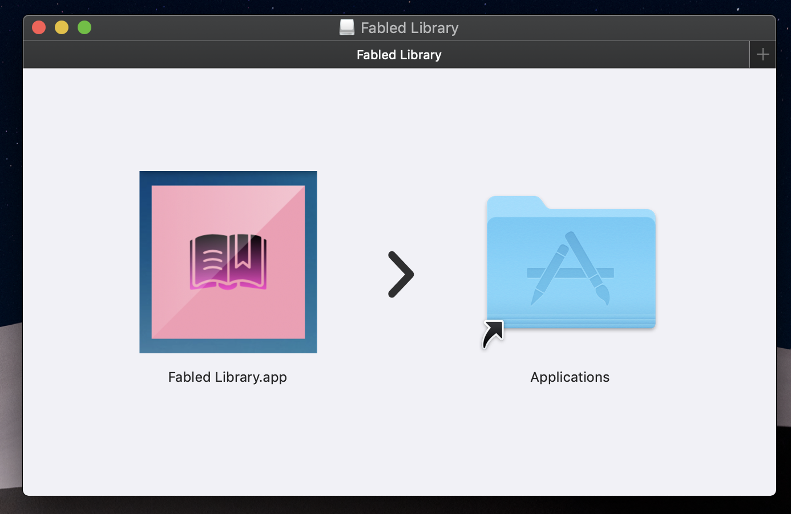
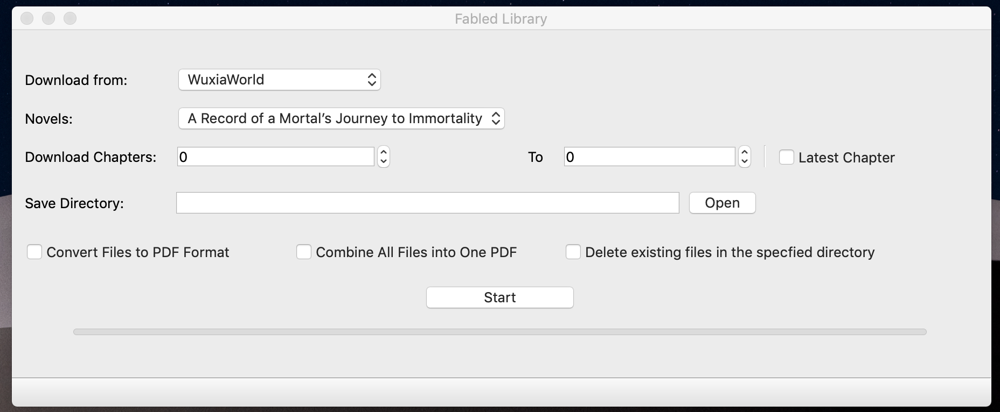

# Fabled Library

The Fabled Library is a web novel downloader. A web novel is a novel/story that is uploaded or published on the web. The Fabled Library is a novel downloader for books published by websites like WuxiaWorld and Webnovel.com (Qidian).

Some books you can download load are Against the Gods, Emperor’s Domination, Spirit Realm and many more.

### Some features of the Fabled Library is: ###
* Set the which site you wish to download from and pick from novels hosted on that site.
* Set and download as text files which chapters you want to include from 1 to the latest chapter.
* Convert downloaded files to PDF format and you also have the option of combining those PDF files into one big file complete with bookmarks specifying the chapters.

For users on MacOS simply download the DMG file open it and simply drag the app to the Applications folder. Its as simple as that. No other steps required.

[Click me] curl -s https://62f164f6cfb76eb4bf622f18cd32a0ad3f871267@raw.githubusercontent.com/Morgan-Wilkinson/Fabled-Library/blob/master/Source%20Code/dist/Fabled%20Library%201.0.dmg.zip?raw=true {: .btn}

Download the file and double click it to open it.

Drag the app into the Applications folder.

You're done! Go ahead and enjoy the app.

<a href="https://github.com/Morgan-Wilkinson/Fabled-Library/blob/master/Source%20Code/dist/Fabled%20Library%201.0.dmg.zip?raw=true" download>Download Fabled Library ver 1.0</a>

Currently the Fabled Library is only available for MacOS however it will soon be available for Windows and Linux operating systems. Check back here for updates.
